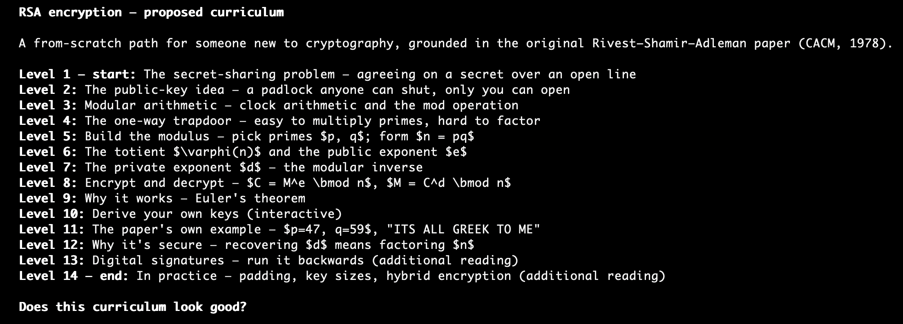
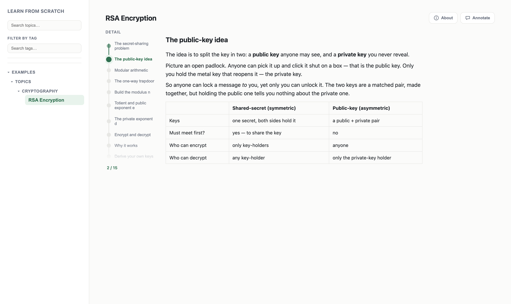
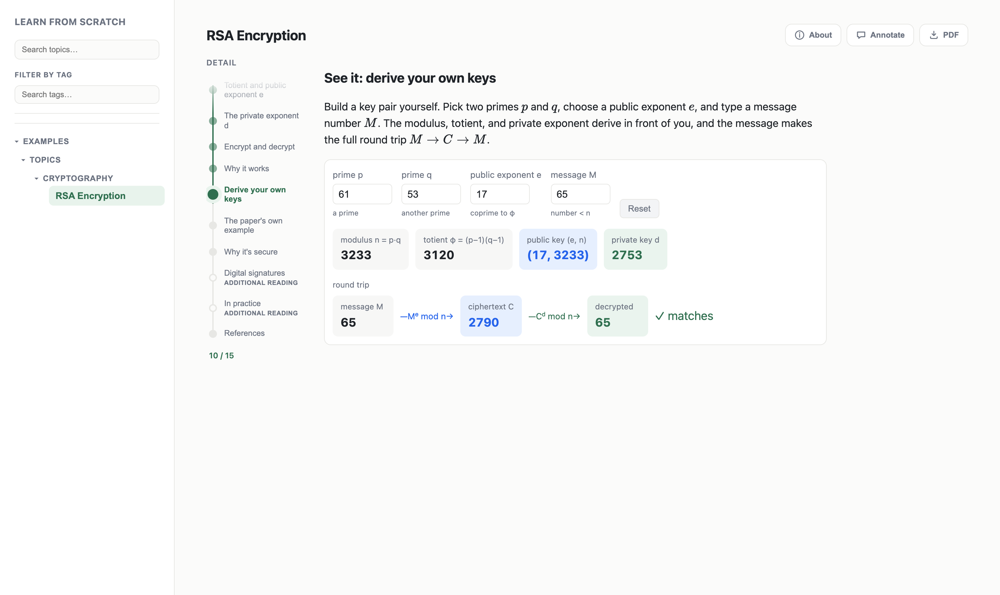

# Learn from scratch

A tool for learning any topic from scratch. A Claude Code skill breaks a topic into a
sequence of slides, and a web app lets you step through them at your own pace.

The aim is to make a new topic both easy to digest and easy to revisit: a topic is usually
only 15 to 25 short steps, each showing a little at once rather than a wall of text, and it
stands on its own. Unlike a book, where a chapter can be hard to follow without the ones
before it, a topic here is readable without chasing other sources — assuming some base
knowledge of the field.

## How to use

Start the app:

```bash
npm install
npm run dev      # start the Vite dev server
```

Open the printed local URL (default http://localhost:5173). A clean clone has no topics
yet — the page shows a "No topics yet" landing until you add one.

### Add a topic

In Claude Code, run the skill (under `.claude/skills/`) with a topic:

```
/learn-from-scratch <topic>
```

The argument can be a subject, a paper, a blog post, or any other source to learn from. The
skill proposes a curriculum, then writes the topic as a leaf folder under `content/`
(e.g. `content/internet/dns/`) containing:

- a `manifest.json` — the topic's levels, sections, and sources;
- one Markdown file per section under `sections/`;
- optional `assets/` — SVGs or per-topic React components.

Before finishing it grounds each claim in a cited source and checks that the diagrams and
math actually render. The topic appears in the sidebar as soon as it's written.

To tailor how much the skill assumes you already know, it keeps a `user-knowledge.md` file
(gitignored, like `content/`) recording what you already know, so it can use those terms
directly. The skill creates this file from `user-knowledge.example.md` on first use —
confirming with you what to keep — and adds to it only with your approval as you learn new
topics.

## The web app

The app lists topics in a left-hand sidebar, organised by folder; selecting one opens its
slides on the right. Each topic is a sequence of sections stepped through by a vertical
level slider — move the slider and it swaps in the next section, one at a time. Slides
support GitHub-flavoured Markdown, KaTeX math, citations, and interactive diagrams.

It also supports:

- **Tags** — every topic carries freeform tags (new ones start as `unread`); add, edit, or
  remove them to organise the library.
- **Search** — filter the sidebar by topic title, or by tag, from the boxes at its top.
- **Archive** — move topics into a separate Archive branch to keep the main list focused.
- **Annotation** — toggle **Annotate** to write notes directly on a slide; annotations are
  saved alongside the slides.
- **PDF export** — **PDF** downloads the whole topic as a single document to share, every
  slide laid out in order.

## Example

This module was generated with:

```
/learn-from-scratch RSA encryption
```

The skill first proposes a curriculum and waits for your go-ahead before generating:



It then writes the slides. A slide can be ordinary prose with a Markdown table — here,
shared-secret vs public-key:



Or a fully interactive React component — here, type your own primes and watch the key
derive and a message round-trip $M \to C \to M$:


